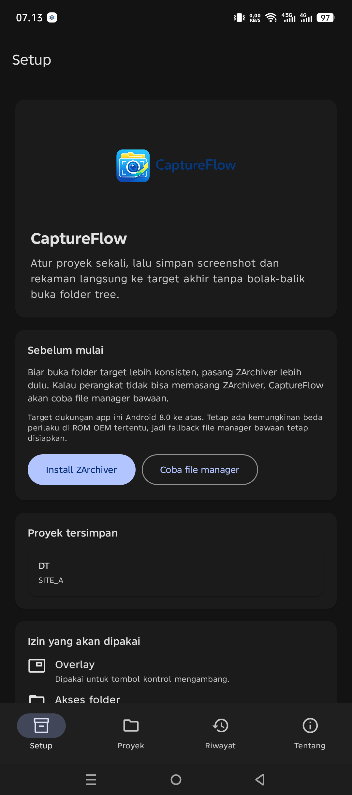
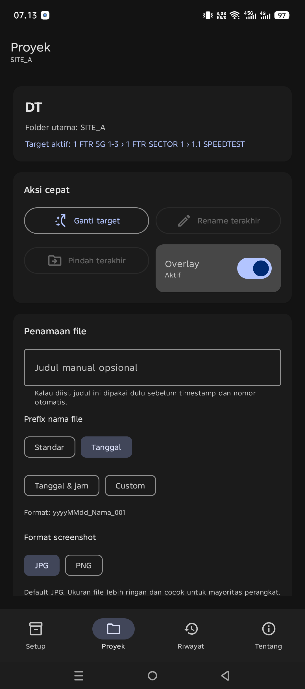
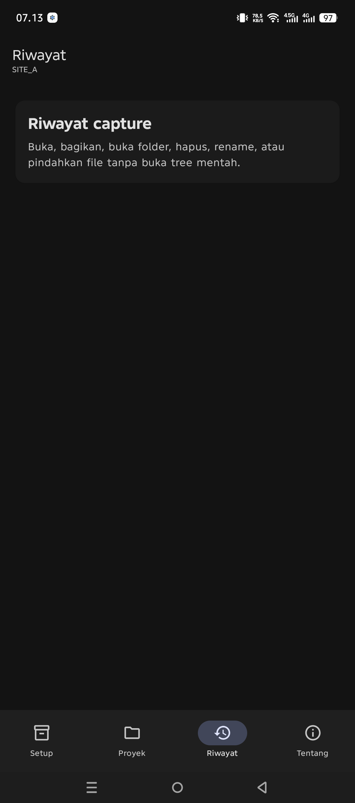
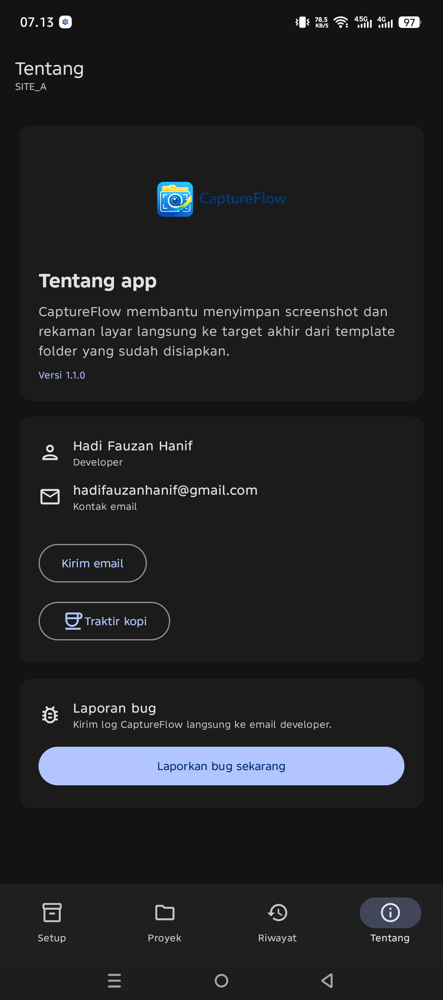

# CaptureFlow

  

  Simpan screenshot dan rekaman layar langsung ke folder yang tepat.

  <a href="download/CaptureFlow-v1.1.0-release.apk"><strong>Download APK</strong></a>
  ·
  <a href="panduan/CaptureFlow-panduan-pengguna.pdf"><strong>Panduan PDF</strong></a>
  ·
  <a href="panduan.html"><strong>Panduan Web</strong></a>

## CaptureFlow membantu apa

- Simpan hasil tangkapan layar ke target folder akhir tanpa buka tree folder penuh.
- Mulai screenshot atau rekam layar dari overlay yang ringkas.
- Rapikan hasil terakhir dengan rename, pindah, bagikan, buka file, atau buka folder.

## Cara pakai singkat

1. Buka CaptureFlow lalu siapkan proyek.
2. Pilih target aktif di layar Proyek.
3. Nyalakan overlay lalu tap Screenshot atau Mulai rekam.
4. Kalau target tadi salah, rapikan dari menu Riwayat.

## Tampilan utama

### Setup

### Proyek

### Riwayat

### Bantuan dan laporan bug

## Download

- APK terbaru: [CaptureFlow-v1.1.0-release.apk](download/CaptureFlow-v1.1.0-release.apk)
- Panduan PDF: [CaptureFlow-panduan-pengguna.pdf](panduan/CaptureFlow-panduan-pengguna.pdf)

## Kontak

- Hadi Fauzan Hanif
- hadifauzanhanif@gmail.com
- Traktir kopi: https://saweria.co/HDfauzan
